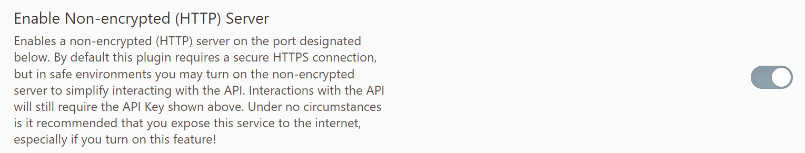
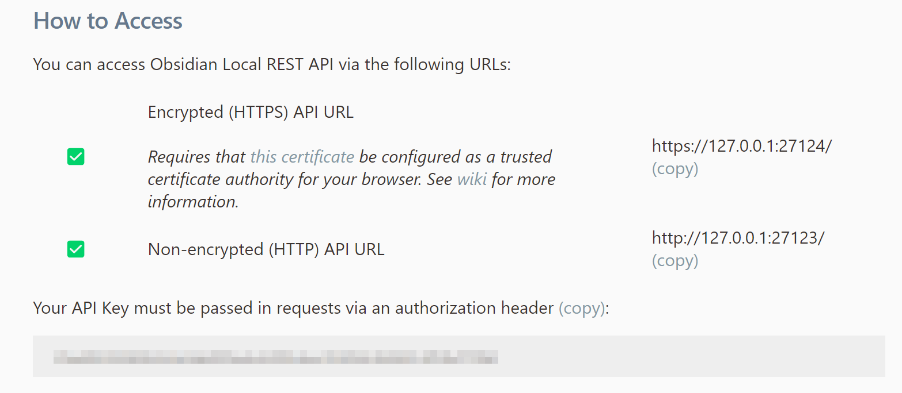

# Obsidian Knowledge Tree

[中文版](README_zh.md)

This script generates a knowledge tree for Obsidian by retrieving files with specific tags from your vault and using large language models to create a comprehensive summary.

This feature should ideally be built into an Obsidian AI plugin, but currently I haven't found a suitable one. Since I'm not familiar with plugin development or frontend work, I implemented this functionality as a Python script. PRs are welcome!

## Usage Guide

1. First, install the [Obsidian Local REST API](https://github.com/coddingtonbear/obsidian-local-rest-api) plugin. 
   - Enable the plugin
   - Allow HTTP service in the settings
   - 

2. Note down your Obsidian API key.
   - 

3. Clone this repository (or download the ZIP file) locally, then install dependencies:
   ```shell
   pip install -r requirements.txt
   ```

4. Configure the Obsidian API and your LLM API by creating a `.env` file with these variables:
   ```.env
   OB_API_BASE_URL="your_obsidian_api_url"
   OB_API_KEY="your_obsidian_api_key"
   LLM_API_BASE_URL="your_llm_api_url"
   LLM_API_KEY="your_llm_api_key"
   ```

5. Run the script:

Windows:
```powershell
python obsidian_summarizer.py `
     --tag '#your_tag' `
     --model 'model_name' `
     --output 'output.md'
```

Linux/macOS:
```shell
python obsidian_summarizer.py \
     --tag '#your_tag' \
     --model 'model_name' \
     --output 'output.md'
```

You'll then receive an AI-generated summary document.

> Follow me on **WeixinMP/SSPAI** (ID: 西郊次生林).