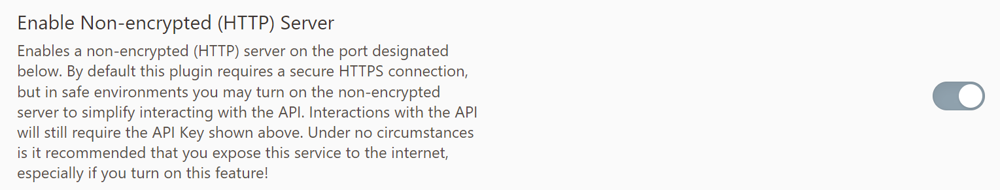

# Obsidian 领域知识树
[English Version](README.md)

这个脚本用于生成 Obsidian 领域知识树，其可以检索你的知识库中带有特定标签的文件，并且调用大模型为这些文件生成一份综述。

这个功能理应被内置在 Obsidian AI 插件中，但目前我还没发现有合适的插件；又因为我本人对开发插件以及前端都不了解，所以我用Python写了一个脚本实现这个小功能。欢迎PR。

# 使用方法
首先你需要安装插件 [Obsidian Local REST API](https://github.com/coddingtonbear/obsidian-local-rest-api)。启用插件，并且在设置界面允许HTTP服务。


记下你的Obsidian密钥。


克隆这个仓库（或者下载zip文件解压）到本地，打开这个文件夹，然后运行以下命令安装依赖：
```shell
pip install -r requirements.txt
```
然后我们需要设置Obsidian API和你的大模型API。创建一个`.env`文件，在里面设置四个变量：
```.env
OB_API_BASE_URL="你的Obsidian API地址"
OB_API_KEY="你的Obsidian密钥"
LLM_API_BASE_URL="你的大模型API地址"
LLM_API_KEY="你的大模型密钥"
```


之后用命令启动脚本：

Windows：
```powershell
python obsidian_summarizer.py `
     --tag '#标签内容' `
     --model '模型名称' `
     --output '输出.md'
```

Linux/macOS：
```shell
python obsidian_summarizer.py \
     --tag '#标签内容' \
     --model '模型名称' \
     --output '输出.md'
```

此时你就可以得到一份AI生成的综述了。

> 欢迎关注我的**公众号/少数派**（ID：西郊次生林）。